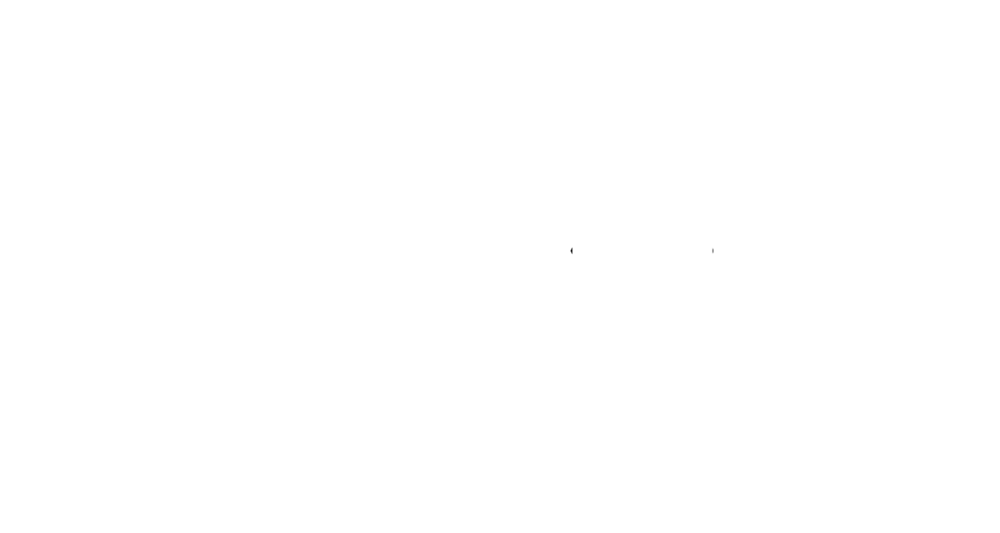

<p align="center">
  <picture>
    <source media="(prefers-color-scheme: dark)" srcset="speclogo.png">
    <source media="(prefers-color-scheme: light)" srcset="speclogo.png">
    
  </picture>
</p>


# SpecBoot — AI Powered Eye Protection Assistant

SpecBoot is an AI-powered desktop assistant designed to remind users to wear UV/protective glasses while using their laptop.

The application automatically starts when the system turns on or wakes from sleep, temporarily accesses the webcam, detects whether the user is wearing glasses using AI, and alerts the user if glasses are not detected.

Once the glasses are detected, the alarm stops automatically and the camera closes.

---

# Inspiration

While working on projects, coding, designing, and spending long hours in front of a screen, I often forgot to wear my glasses.

Almost every day I used to hear:

> “Wear your specs while using the laptop.”

Even after being reminded multiple times, I kept forgetting it repeatedly.

That made me think:

> “Why not create something that reminds me automatically?”

Instead of creating a normal reminder application, I wanted to build something smarter — an AI assistant that could actually verify whether I was wearing my glasses or not.

That idea eventually became SpecBoot.

---

# Features

- AI-powered glasses detection
- Automatic webcam access during startup
- Alarm notification if glasses are not detected
- Automatic alarm stop after glasses detection
- Automatic camera shutdown after successful detection
- Automatic launch during system startup
- Sleep/wakeup monitoring support
- Screen unlock rechecking
- Modern desktop UI
- System tray support
- Windows notifications
- Lightweight Electron desktop application

---

# How It Works

```plaintext
Laptop Starts
    ↓
SpecBoot Launches Automatically
    ↓
Webcam Opens
    ↓
AI Detects Glasses
    ↓
If Glasses Are Not Detected
    → Alarm Starts
    ↓
If Glasses Are Detected
    → Alarm Stops
    → Camera Closes
```

---

# Tech Stack

| Technology | Purpose |
|---|---|
| Electron | Desktop Application |
| JavaScript | Application Logic |
| HTML/CSS | User Interface |
| TensorFlow.js | AI Model Inference |
| Teachable Machine | AI Model Training |
| Webcam API | Camera Access |
| Electron Tray | Background System Tray |
| Electron Notifications | System Alerts |

---

# Project Structure

```plaintext
SpecBot/
│
├── main.js
├── renderer.js
├── index.html
├── style.css
├── package.json
├── icon.ico
├── tray.ico
├── logo.png
├── alarm.mp3
│
├── model/
│   ├── model.json
│   ├── metadata.json
│   └── weights.bin
│
├── dist/
└── node_modules/
```

# Installation

## Clone Repository

```bash
git clone https://github.com/harikrishnan669/SpecBoot.git
```

---

## Install Dependencies

```bash
npm install
```

---

## Run Application

```bash
npm start
```

---

## Build Desktop Application

```bash
npm run build
```

---
